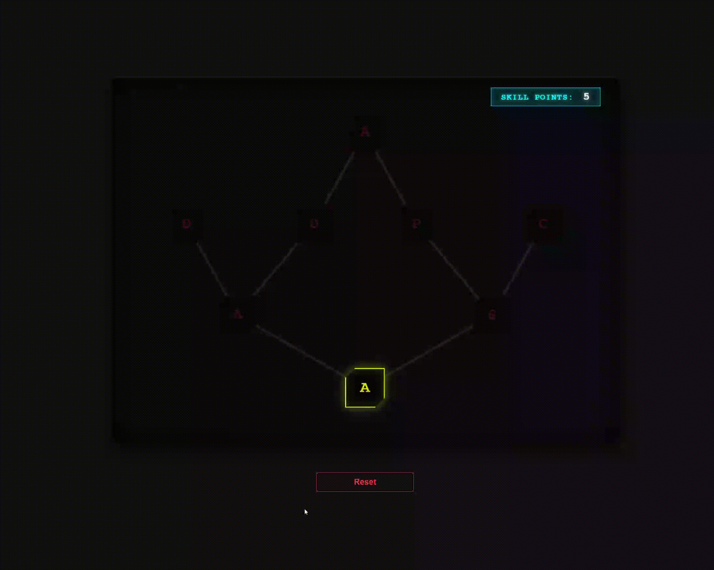

# TreeTalants

Интерактивное древо талантов в стиле **киберпанк**, разработанное на Vue 3.



## Технологии
- **Vue 3** (Composition API)
- **Pinia** (Управление состоянием, логика зависимостей и Skill Points)
- **SCSS** (Динамическая стилизация, `clip-path`, неоновые эффекты, CSS-анимации)
- **Vite** (Инструмент сборки)

## Особенности
- Система прокачки с логикой зависимостей (строгая иерархия).
- SVG-линии связи с динамическим эффектом свечения.
- Учет доступных очков навыков (Skill Points) и сброс прогресса.
- Динамические цвета узлов и тултипов в зависимости от состояния (Locked, Available, Learned, Out of Points).

## Запуск
```bash
npm install
npm run dev
```
